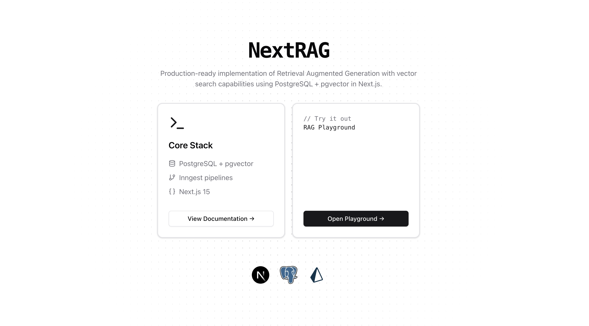

# NextRag: Next.js RAG with PGVector


A production-ready implementation of Retrieval Augmented Generation (RAG) using Next.js, PostgreSQL + pgvector (with `node-pg`), Prisma, and Vercel AI SDK.

## Introduction

This project demonstrates how to implement RAG (Retrieval Augmented Generation) using PostgreSQL's vector similarity search capabilities. It's designed as a reference implementation that you can adapt for your specific use case.

### Key Concepts

1. **Vector Embeddings**: Text is converted into high-dimensional vectors that capture semantic meaning using OpenAI's embedding models.

2. **Similarity Search**: pgvector enables efficient similarity search between these vectors, helping find relevant content.

3. **Chunking Strategies**: Documents are broken down into manageable pieces using different strategies (sentence, paragraph, or fixed-size) to optimize retrieval.

4. **Metadata Tracking**: Each chunk maintains metadata about its source, creation time, and relationship to other chunks.

5. **Background Processing**: Long-running tasks like document ingestion are handled asynchronously using Inngest.

### Sample Implementation

This codebase provides:

- A flexible `VectorDB` class for vector operations
- Multiple chunking strategies
- Configurable similarity metrics
- Type-safe database operations
- RAG-powered chat interface

## Features

- 🔍 Semantic search with pgvector
- 🤖 RAG-powered chat interface
- 📝 Multiple text chunking strategies
- 🔄 Background processing with Inngest
- 🎯 Flexible similarity metrics
- 📊 Rich metadata support
- 🔒 Type-safe database operations

## Tech Stack

- **Next.js 15** - React framework
- **PostgreSQL + pgvector** - Vector similarity search
- **Vercel AI SDK** - AI/LLM utilities
- **Prisma** - Type-safe database schema
- **node-pg** - SQL query sanitization
- **Inngest** - Background job processing
- **OpenAI** - Embeddings and chat completion
- **Tailwind CSS** - Styling
- **TypeScript** - Type safety

## Quick Start

## 1. **Clone and Install**

```bash
git clone https://github.com/hamedmp/nextrag
cd nextrag
pnpm install
```

## 2. **Environment Setup**

You need environment variables for the LLM of your choice and the Database

```bash
cp .env.example .env
```

Required environment variables:

```bash
# Database (Vercel Postgres or Neon)
POSTGRES_URL="postgres://..."

# OpenAI
OPENAI_API_KEY="sk-..."

# node-pg
PGUSER=...
PGPASSWORD=...
PGHOST=...
PGPORT=...
PGDATABASE=...

# Inngest (optional, for background jobs)
INNGEST_EVENT_KEY="..."
INNGEST_SIGNING_KEY="..."
```

## 3. **Database Setup**

### Option 1: Enable pgvector extension manually

Enable pgvector extension in your PostgreSQL database:

```sql
CREATE EXTENSION IF NOT EXISTS vector;
```

### Option 2: Enable pgvector extension with Prisma migrations

Alternatively, you can do it with the generated Prisma migrations:

Prisma doesn't natively support pgvector's vector type, but we can use the `Unsupported` scalar:

```prisma
generator client {
  provider = "prisma-client-js"
}

datasource db {
  provider = "postgresql"
  url      = env("POSTGRES_URL")
}

model documents {
  id        BigInt                 @id @default(autoincrement())
  content   String?
  embedding Unsupported("vector")?
  metadata  Json?                  @default("{}")
  createdAt DateTime              @default(now())
  updatedAt DateTime              @updatedAt
}
```

#### Migrations

1. Create a migration:

```bash
pnpm prisma migrate dev --name add_vector_support
```

2. In the generated migration file, add pgvector setup:

```sql
-- Enable pgvector extension
CREATE EXTENSION IF NOT EXISTS vector;

-- CreateTable
CREATE TABLE "documents" (
    "id" BIGSERIAL NOT NULL,
    "content" TEXT,
    "embedding" vector(1536),
    "metadata" JSONB DEFAULT '{}',
    "createdAt" TIMESTAMP(3) NOT NULL DEFAULT CURRENT_TIMESTAMP,
    "updatedAt" TIMESTAMP(3) NOT NULL,
    CONSTRAINT "documents_pkey" PRIMARY KEY ("id")
);

-- Create HNSW index for faster similarity search
CREATE INDEX ON documents USING hnsw (embedding vector_cosine_ops);
```

3. Apply the migration:

```bash
pnpm prisma migrate deploy
```

## 4. **Run Development Server and Inngest server**

In a separate terminal, run the Inngest server:

```bash
pnpm run inngest
```

The server will start on `http://127.0.0.1:8288`.

In another separate terminal, run the Next.js development server:

```bash
pnpm dev
```

Visit `http://localhost:3000` to see the app.

## VectorDB Usage

The `VectorDB` class provides a flexible interface for vector operations:

```typescript
// Initialize with table configuration
const vectorDB = new VectorDB(
  {
    tableName: 'documents',
    columns: {
      id: 'id',
      vector: 'embedding',
      content: 'text',
      metadata: 'metadata',
      createdAt: 'createdAt',
    },
  },
  {
    // Optional custom configuration
    embedding: {
      model: 'text-embedding-3-small',
      dimensions: 1536,
      distance: 'cosine',
    },
    chunking: {
      method: 'paragraph',
      fixedSize: 500,
    },
    search: {
      defaultLimit: 5,
    },
  }
);

// Add text with chunking and metadata
await vectorDB.addText('Your content here', {
  chunkingMethod: 'paragraph',
  metadata: {
    source: 'documentation',
    category: 'setup',
  },
});

// Search with filters and custom options
const results = await vectorDB.searchSimilar('your query', {
  limit: 10,
  distance: 'cosine',
  filter: { category: 'setup' },
  select: ['content', 'metadata->category as category'],
});
```

## Chunking Methods

Three text chunking strategies are available:

```typescript
// 1. Sentence-based chunking
const chunks = vectorDB.chunkText(text, 'sentence');

// 2. Paragraph-based chunking (split by double newline)
const chunks = vectorDB.chunkText(text, 'paragraph');

// 3. Fixed-size chunking (with word boundaries)
const chunks = vectorDB.chunkText(text, 'fixed');
```

## Similarity Metrics

PGVector supports multiple similarity metrics:

```typescript
// Cosine similarity (normalized, recommended for OpenAI embeddings)
await vectorDB.searchSimilar(query, { distance: 'cosine' });

// Euclidean distance
await vectorDB.searchSimilar(query, { distance: 'euclidean' });

// Inner product
await vectorDB.searchSimilar(query, { distance: 'inner_product' });
```

## Search Methods

NextRAG supports three search methods:

1. **Vector Similarity Search**

   - Uses pgvector for semantic similarity
   - Best for understanding context and meaning
   - ```typescript
     await vectorDB.search(query, { method: 'vector' });
     ```

2. **BM25 Text Search**

   - Uses PostgreSQL's full-text search with BM25 ranking
   - Best for keyword matching and exact phrases
   - ```typescript
     await vectorDB.search(query, { method: 'bm25' });
     ```

3. **Hybrid Search**
   - Combines vector similarity and BM25 scores
   - Balances semantic understanding with keyword relevance
   - ```typescript
     await vectorDB.search(query, {
       method: 'hybrid',
       weights: {
         vector: 0.6, // Adjust these weights
         bm25: 0.4, // based on your needs
       },
     });
     ```

### Configuration

Configure search methods in your VectorDB instance:

```typescript
const vectorDB = new VectorDB(
  {
    // ... table config
  },
  {
    search: {
      method: 'hybrid', // default search method
      weights: {
        vector: 0.6, // semantic similarity weight
        bm25: 0.4, // text relevance weight
      },
      defaultLimit: 5,
      reranking: false,
    },
  }
);
```

### Search Results

Results include both vector and BM25 scores:

```typescript
{
  content: string;           // The matched text
  similarity?: number;       // Combined similarity score (0-1)
  vectorScore?: number;      // Vector similarity score (0-1)
  bm25Score?: number;       // BM25 relevance score (0-1)
  metadata?: Record<string, any>;
}
```

Choose the appropriate search method based on your needs:

- Use `vector` for semantic understanding
- Use `bm25` for keyword matching
- Use `hybrid` for balanced results

## Project Structure

```
src/
├── app/                    # Next.js App Router pages
│   ├── (chat)/            # Playground
│   ├── api/               # API routes
│   └── docs/              # Documentation pages
├── components/            # UI components
├── lib/
│   ├── db/               # Database utilities
│   │   ├── vector.ts     # VectorDB class
│   │   └── config.ts     # Configuration
│   └── actions/          # Server actions
└── inngest/              # Background jobs
```

## Development

### Prerequisites

- Node.js 18+
- PostgreSQL 15+ with pgvector extension
- OpenAI API key
- Vercel account (for deployment)

### Database Indexes

For better search performance, create appropriate indexes:

```sql
-- For cosine similarity (recommended)
CREATE INDEX ON documents USING hnsw (embedding vector_cosine_ops);

-- For L2 distance
CREATE INDEX ON documents USING hnsw (embedding vector_l2_ops);
```

## Contributing

1. Fork the repository
2. Create your feature branch (`git checkout -b feature/amazing-feature`)
3. Commit your changes (`git commit -m 'Add amazing feature'`)
4. Push to the branch (`git push origin feature/amazing-feature`)
5. Open a Pull Request

## License

MIT License - see [LICENSE](LICENSE) file for details.

## Acknowledgments

- [Vercel AI SDK](https://sdk.vercel.ai/docs)
- [pgvector](https://github.com/pgvector/pgvector)
- [Inngest](https://www.inngest.com/)
- [Prisma](https://www.prisma.io/)

---

Built with ❤️ using Next.js and pgvector
